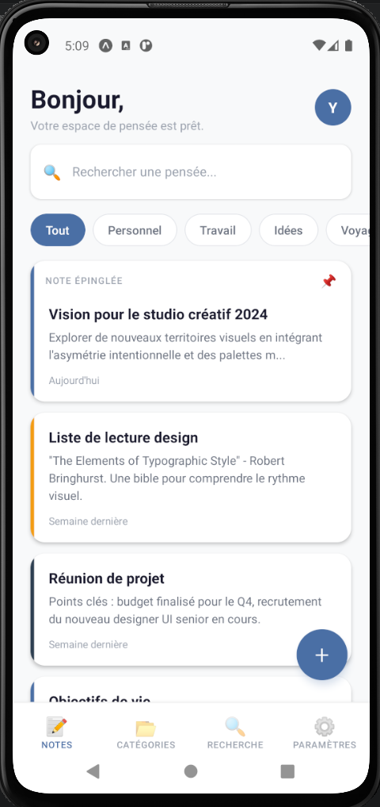
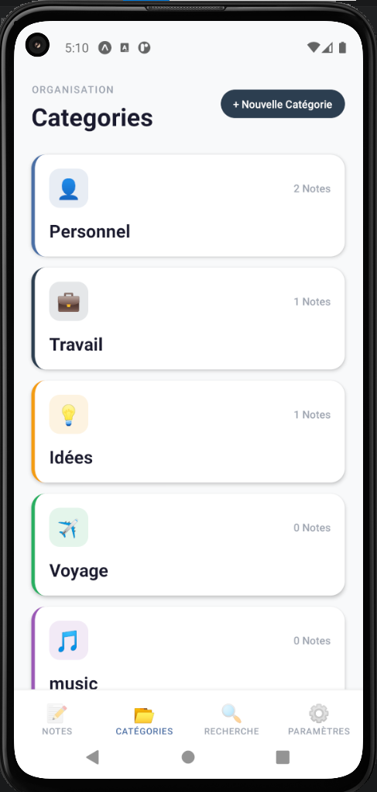

# 🎨 Mindful Canvas

Une application mobile de gestion de notes personnelles, construite avec React Native et Expo.

---

## ✨ Fonctionnalités

- 📝 Créer, modifier et supprimer des notes
- 📌 Épingler des notes importantes
- 📂 Organiser les notes par catégories
- 🔍 Rechercher une note en temps réel
- 🎨 Filtrer par catégorie depuis l'accueil
- 📊 Statistiques de l'espace de travail
- ☁️ Sauvegarde locale avec AsyncStorage

---

## 🛠 Stack technique

| Technologie | Rôle |
|---|---|
| React Native + Expo | Framework mobile |
| TanStack React Query | Gestion des données & cache |
| Zustand | État global (thème, filtres, recherche) |
| AsyncStorage | Persistance locale |
| React Navigation | Navigation (Stack + Bottom Tabs) |

---

## 📁 Architecture
src/
├── screens/         → Écrans principaux
├── components/      → Composants réutilisables
├── hooks/           → React Query hooks (Query Options pattern)
├── store/           → Store Zustand
├── services/        → Couche données AsyncStorage
└── navigation/      → Configuration React Navigation

---

## 🚀 Lancer le projet

```bash
git clone https://github.com/ton-username/mindful-canvas.git
cd mindful-canvas
npm install
npx expo start
```

---

## 📱 Aperçu

### 📝 Liste des notes



### 📂 Catégories



---

## 💡 Patterns appliqués

**Query Options Pattern** — Les options React Query sont définies une seule fois dans les fichiers `hooks/` et réutilisées partout :

```js
export const notesQueryOptions = queryOptions({
  queryKey: ['notes'],
  queryFn: getNotes,
});

export const useNotes = () => useQuery(notesQueryOptions);
```

**Zustand** — Store léger pour l'état global UI (filtre actif, recherche, thème) sans prop drilling.

## ⚠️ Limitations connues

### Fonctionnalités non implémentées
- 🖊️ **Formatage du texte** — Les boutons de la toolbar (gras, italique, listes, citations) sont présents visuellement mais non fonctionnels. Nécessite une lib comme `react-native-rich-editor`
- 🔒 **Code PIN** — Le bouton "Configurer le code" est présent mais non fonctionnel
- 🌙 **Dark mode** — Le switch Clair/Sombre est connecté au store Zustand mais le thème n'est pas encore appliqué sur tous les écrans
- 🔍 **Écran Search dédié** — L'onglet Search redirige actuellement vers la liste des notes. Un écran de recherche avancée est prévu
- 🖼️ **Images dans les notes** — Le bouton image dans la toolbar n'est pas fonctionnel
- ↗️ **Politique de confidentialité / Support** — Liens non connectés

### Limitations techniques
- 📦 **Stockage 100% local** — Pas de backend réel, toutes les données sont stockées dans AsyncStorage
- 👤 **Pas d'authentification** — Pas de système de compte utilisateur
- 🔄 **Pas de synchronisation cloud** — La sauvegarde automatique est simulée

